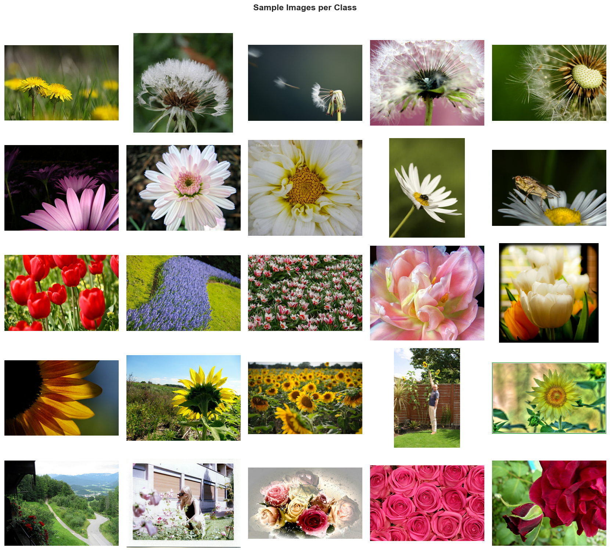
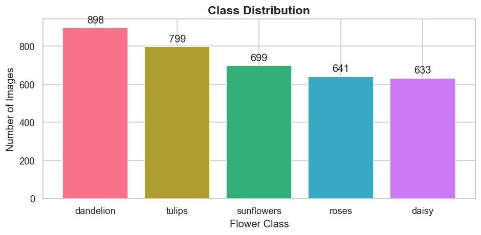
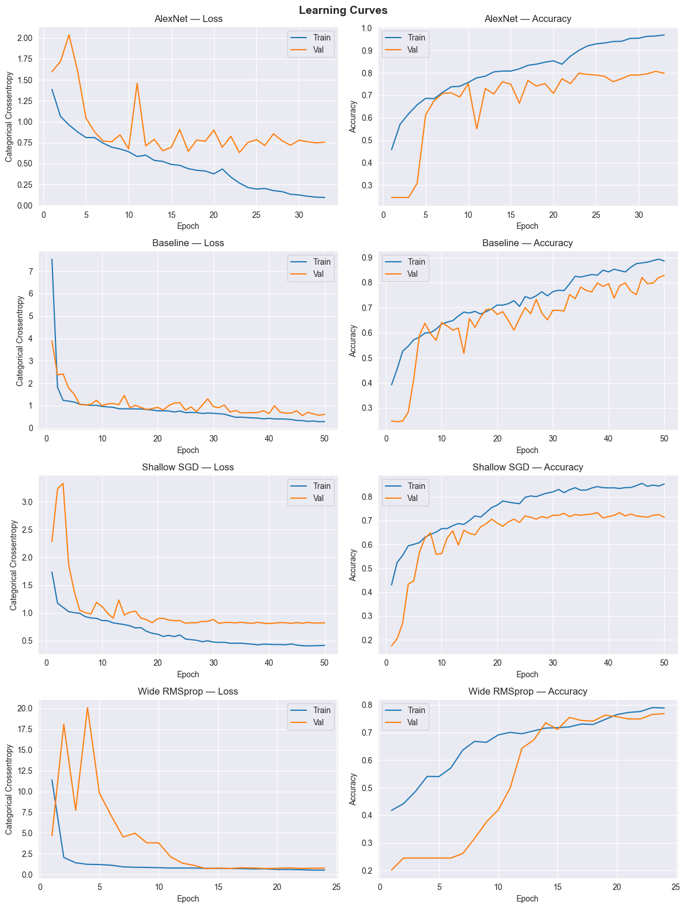
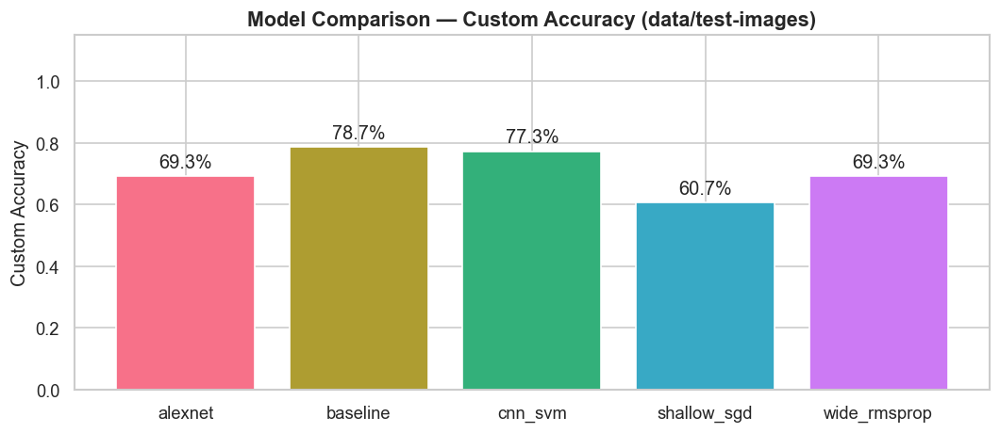
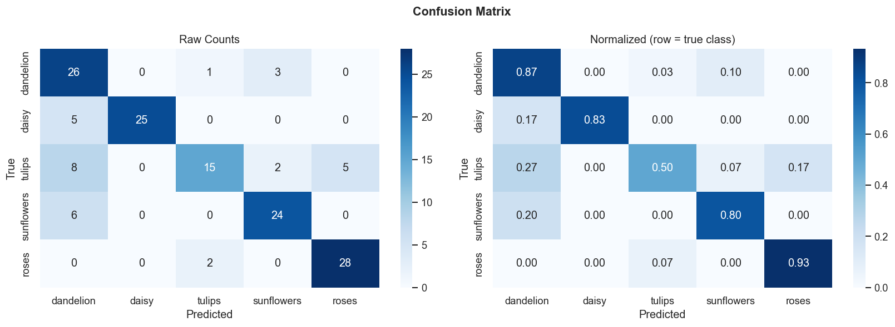

---
header-includes:
  - \usepackage{titlesec}
  - \titleformat{\paragraph}[block]{\normalfont\normalsize\bfseries}{}{}{}
  - \titlespacing*{\paragraph}{0pt}{1.5ex plus 0.5ex minus 0.2ex}{0.5ex}
---

# Blumenerkennung mit Convolutional Neural Networks
## Projektdokumentation – AI-Engineering, Hochschule Campus Wien, SS 2026

**Autoren:** Fabian Gerö, Philipp Huber, Gökmen Kiyan, Patrick Weiss  
**Datum:** Mai 2026  
**Repository:** flower-image-classifier

---

## Inhaltsverzeichnis

1. [Motivation](#1-motivation)
2. [State of the Art – verwendete Methoden](#2-state-of-the-art--verwendete-methoden)
3. [Methoden und Implementierung](#3-methoden-und-implementierung)
4. [Ergebnisse](#4-ergebnisse)
5. [Diskussion](#5-diskussion)
6. [Fazit](#6-fazit)

---

## 1. Motivation

Bildklassifikation gehört zu den grundlegenden Aufgaben im Bereich des maschinellen Lernens und ist ein ideales Einstiegsprojekt, um das Zusammenspiel von Daten, Modellarchitektur und Training praktisch zu erfahren. Die Aufgabe, Blumenbilder automatisch einer von fünf Kategorien zuzuordnen, bietet dabei eine angenehme Mischung aus visueller Intuition (Menschen können Blumen problemlos unterscheiden) und technischer Herausforderung (für Maschinen ist es nicht trivial, da Blumen in Farbe, Form und Kontext stark variieren).

Das Ziel dieses Projekts war es, einen vollständigen Machine-Learning-Workflow von Grund auf zu implementieren – ohne den Einsatz von vortrainierten Modellen (kein Transfer Learning). Konkret bedeutet das:

- Eigene CNN-Architekturen entwerfen und trainieren
- Verschiedene Architekturen und Hyperparameter systematisch vergleichen
- Den Einfluss von Modellkomplexität, Optimizer und Augmentierung untersuchen
- Ein hybrides CNN+SVM-Modell als Alternative zum klassischen Softmax-Klassifikator implementieren
- Die Generalisierungsfähigkeit auf einem selbst zusammengestellten Test-Datensatz evaluieren

Das Projekt ist im Rahmen des AI-Praktikums entstanden und legt besonderen Wert auf Reproduzierbarkeit und strukturierte Experimente.

---

## 2. State of the Art – verwendete Methoden

Dieser Abschnitt beschreibt die theoretischen Grundlagen der im Projekt eingesetzten Techniken.

### 2.1 Convolutional Neural Networks (CNNs)

CNNs sind neuronale Netzwerke, die speziell für die Verarbeitung von Bilddaten entwickelt wurden. Ihr wesentlicher Vorteil gegenüber vollständig verbundenen Netzwerken liegt in der lokalen Konnektivität: Statt jedes Pixel mit jedem Neuron zu verbinden, lernt ein Convolutional Layer **Filter** (auch Kernel genannt), die über das Bild geschoben werden und lokale Muster – wie Kanten, Texturen oder Formen – erkennen.

**Grundbausteine eines CNN-Blocks:**

- **Conv2D:** Ein lernbarer Filter der Größe k×k wird über das Eingabebild geschoben und erzeugt eine Feature Map. Durch mehrere Filter pro Layer werden verschiedene Merkmale parallel extrahiert.
- **Batch Normalization:** Normalisiert die Aktivierungen innerhalb eines Mini-Batches. Das stabilisiert das Training, erlaubt höhere Lernraten und wirkt leicht regularisierend.
- **MaxPooling:** Reduziert die räumliche Auflösung der Feature Maps (typischerweise Halbierung). Dadurch sinkt der Rechenaufwand, und das Netz wird invarianter gegenüber kleinen Verschiebungen im Bild.
- **ReLU-Aktivierung:** Die Rectified Linear Unit (`f(x) = max(0, x)`) ist die Standard-Aktivierungsfunktion in modernen CNNs. Sie führt Nichtlinearität ein, ohne unter dem Vanishing-Gradient-Problem zu leiden.

Durch das Stapeln mehrerer solcher Blöcke lernt das Netz hierarchisch: Frühe Layer erkennen einfache Muster (Kanten, Farben), spätere Layer kombinieren diese zu komplexeren Strukturen (Blütenblätter, Blumenköpfe).

### 2.2 AlexNet

AlexNet (Krizhevsky et al., 2012) war das erste tiefe CNN, das den ImageNet-Wettbewerb dominierte und die Deep-Learning-Ära einläutete. Die Architektur besteht aus fünf Convolutional Layern und drei vollständig verbundenen Layern. Charakteristisch ist der große erste Kernel (11×11 mit Stride 4), der einen großen Bildausschnitt auf einmal erfasst, sowie der Einsatz von Dropout zur Regularisierung.

Im Projekt wurde eine an AlexNet angelehnte Architektur implementiert, die an das kleinere Datensatzformat angepasst wurde (224×224 statt der originalen ImageNet-Auflösung von mehr als 1000×1000 Pixel).

### 2.3 Datenaugmentierung

Da der verwendete Datensatz mit ca. 3.670 Bildern für ein tiefes CNN relativ klein ist, spielt Datenaugmentierung eine wichtige Rolle. Dabei werden Trainingsbilder zufällig transformiert, bevor sie dem Netz präsentiert werden. Das Netz sieht so in jeder Epoche leicht unterschiedliche Versionen eines Bildes und kann dadurch besser generalisieren.

Im Projekt eingesetzte Augmentierungen:

- **RandomFlip (horizontal):** Spiegelt das Bild zufällig – Blumen sehen gespiegelt gleich aus.
- **RandomRotation (±10°):** Rotiert das Bild leicht – Blumen wachsen nicht immer gerade.
- **RandomZoom (±10%):** Verändert den Zoom-Faktor leicht.
- **RandomBrightness (±20%):** Simuliert unterschiedliche Lichtverhältnisse.
- **RandomContrast (±20%):** Variiert den Kontrast – simuliert verschiedene Kamerasettings.

### 2.4 Optimierungsverfahren

Das Training neuronaler Netze erfolgt durch Gradientenabstieg: Der Verlust (Loss) wird berechnet, und die Gewichte werden in Richtung des negativen Gradienten angepasst. Verschiedene Optimierer unterscheiden sich in der Art, wie der Gradientenabstieg durchgeführt wird:

- **SGD (Stochastic Gradient Descent):** Die einfachste Form – ein Mini-Batch bestimmt den Gradienten, der Lernrate skaliert den Schritt. Stabil, aber langsam.
- **Adam (Adaptive Moment Estimation):** Kombiniert Momentum (glättet den Gradienten über Zeit) mit adaptiver Lernrate pro Parameter. In der Praxis sehr robust und konvergiert oft schneller als SGD.
- **RMSprop:** Ähnlich wie Adam, normalisiert den Gradienten durch einen gleitenden Durchschnitt der quadrierten Gradienten. Gut für nicht-stationäre Zielfunktionen.

### 2.5 Support Vector Machines (SVM)

Eine SVM ist ein klassischer Klassifikationsalgorithmus, der eine optimale Trennhyperplane zwischen Klassen sucht – maximiert wird dabei der Abstand (Margin) zwischen der Hyperplane und den nächstgelegenen Datenpunkten (Support Vectors). Mit dem RBF-Kernel (Radial Basis Function) kann die SVM auch nichtlinear trennbare Daten klassifizieren.

Im hybriden CNN+SVM-Ansatz wird die SVM nicht direkt auf Rohdaten angewendet, sondern auf die hochdimensionalen Feature-Repräsentationen, die das CNN extrahiert. Die Idee: Das CNN lernt, relevante visuelle Merkmale zu extrahieren; die SVM klassifiziert diese effizienter als ein einfacher Softmax-Layer.

### 2.6 Evaluationsmetriken

- **Accuracy:** Anteil korrekt klassifizierter Bilder – einfach zu interpretieren, aber anfällig bei unbalancierten Klassen.
- **Precision:** Von allen als Klasse X vorhergesagten Bildern, wie viele waren tatsächlich Klasse X?
- **Recall:** Von allen tatsächlichen Bildern der Klasse X, wie viele wurden korrekt erkannt?
- **F1-Score:** Harmonisches Mittel aus Precision und Recall – guter Kompromiss zwischen beiden Metriken.
- **Konfusionsmatrix:** Zeigt übersichtlich, welche Klassen wie häufig mit welcher anderen verwechselt werden.

---

## 3. Methoden und Implementierung

### 3.1 Datensatz

Als Grundlage dient der **TensorFlow Flowers Datensatz** (`tf_flowers`), der über `tensorflow-datasets` geladen wird. Er enthält ca. 3.670 Bilder in fünf Klassen:

| Klasse | Beschreibung |
|---|---|
| Daisy | Gänseblümchen |
| Dandelion | Löwenzahn |
| Roses | Rosen |
| Sunflowers | Sonnenblumen |
| Tulips | Tulpen |

Die Bilder liegen in unterschiedlichen Auflösungen vor und wurden für das Training auf **128×128 Pixel** (bzw. 224×224 für AlexNet) skaliert und auf den Wertebereich [0, 1] normalisiert.

**Aufteilung:** Der Datensatz wurde stratifiziert aufgeteilt, um die Klassenverteilung in allen Splits zu erhalten:
- **Training:** 80%
- **Validierung:** 10%
- **Test:** 10%

Zusätzlich wurde ein **eigener Test-Datensatz** mit 150 Bildern (30 pro Klasse) manuell zusammengestellt. Dieser dient der Evaluation der Generalisierungsfähigkeit auf Bilder, die nicht aus der ursprünglichen Datensatzverteilung stammen.


*Abbildung 1: Beispielbilder aus dem tf_flowers-Datensatz (je eine pro Klasse)*


*Abbildung 2: Klassenverteilung im tf_flowers-Datensatz*

### 3.2 Projektstruktur

Das Projekt folgt einer klaren modularen Struktur:

```
flower-image-classifier/
├── src/
│   ├── model.py          # Modellarchitekturen (CNN, AlexNet)
│   ├── train.py          # Trainingslogik
│   ├── train_hybrid.py   # CNN+SVM-Training
│   ├── evaluate.py       # Evaluation auf Custom-Testset
│   ├── predict.py        # Einzelbild-Inferenz
│   └── preprocess.py     # Datenladung und -vorverarbeitung
├── configs/              # YAML-Konfigurationsdateien pro Experiment
├── notebooks/            # Jupyter Notebooks für Analyse
├── models/               # Gespeicherte Modelle
└── data/                 # Datensatz (lokal, nicht im Repository)
```

Jedes Experiment wird durch eine eigene YAML-Konfigurationsdatei beschrieben. Das erlaubt eine reproduzierbare, übersichtliche Verwaltung verschiedener Modell-Varianten.

### 3.3 Modellarchitekturen

#### 3.3.1 Custom CNN (Baseline und Varianten)

Das Basis-CNN ist ein parametrisierbares Netz aus **n Convolutional Blöcken**, gefolgt von einem vollständig verbundenen Klassifikationskopf. Jeder Block besteht aus:

```
Conv2D (k Filter, 3×3, ReLU) → Batch Normalization → MaxPooling (2×2)
```

Die Filteranzahl verdoppelt sich mit jedem Block (32 → 64 → 128 → 256), sodass das Netz mit zunehmender Tiefe mehr und komplexere Merkmale extrahiert. Vor dem ersten Block befindet sich ein Datenaugmentierungsmodul, das nur während des Trainings aktiv ist.

\footnotesize

| Konfig. | Blöcke | Filter | Dense | Dropout | Optimizer | LR | Params |
|---|---|---|---|---|---|---|---|
| baseline | 4 | 32 | 512 | 0.5 | Adam | 0.001 | 8,78M |
| shallow\_sgd | 2 | 32 | 256 | 0.3 | SGD | 0.01 | 16,80M |
| wide\_rmsprop | 4 | 64 | 512 | 0.5 | RMSprop | 0.0005 | 18,34M |

\normalsize

#### 3.3.2 AlexNet-Variante

Als tieferes Referenzmodell wurde eine AlexNet-inspirierte Architektur implementiert. Sie verwendet größere Eingabebilder (224×224) und tiefere Convolutional Blöcke:

```
Input (224×224×3)
→ Conv2D (96 Filter, 11×11, Stride 4) → BatchNorm → MaxPool
→ Conv2D (256 Filter, 5×5) → BatchNorm → MaxPool
→ Conv2D (384 Filter, 3×3)
→ Conv2D (384 Filter, 3×3)
→ Conv2D (256 Filter, 3×3) → MaxPool
→ Dense (4096) → Dropout (0.5)
→ Dense (4096) → Dropout (0.5)
→ Dense (5, Softmax)
```

Mit 58,30M Parametern ist AlexNet etwa 6,6-mal größer als das Baseline-Modell.

#### 3.3.3 Hybrides CNN+SVM

Beim hybriden Ansatz wird das trainierte Baseline-CNN als **Feature Extractor** genutzt: Die letzten Schichten werden entfernt, und das Netz gibt für jedes Bild einen 512-dimensionalen Feature-Vektor aus. Diese Vektoren werden anschließend mit einem **RBF-SVM** (C=10) klassifiziert, der zuvor mit einem StandardScaler normalisiert wird.  
\footnotesize
```
Bild → CNN-Backbone (eingefroren) → 512-dim Feature-Vektor → StandardScaler → SVM (RBF, C=10) → Klasse
```
\normalsize
### 3.4 Trainingsprotokoll

Das Training wurde für alle Modelle nach folgendem Schema durchgeführt:

- **Loss-Funktion:** Categorical Cross-Entropy (Standard für Mehrklassenklassifikation)
- **Maximale Epochen:** 50
- **Early Stopping:** Training stoppt, wenn die Validierungsgenauigkeit 10 Epochen lang nicht steigt; bestes Modell wird gespeichert.
- **ReduceLROnPlateau:** Lernrate wird halbiert, wenn die Validierungsgenauigkeit 5 Epochen lang stagniert.
- **ModelCheckpoint:** Bestes Modell (nach Validierungsgenauigkeit) wird automatisch gespeichert.


*Abbildung 3: Vergleich der Trainings- und Validierungsverläufe aller Modelle (Training vs. Validierung)*

Beim Baseline-Modell verliefen Training und Validierung eng beieinander – ein Zeichen guter Regularisierung durch Dropout und Augmentierung. Die Lernrate wurde automatisch zweimal reduziert (nach Epoch 32 und 46), was in beiden Fällen zu weiterer Verbesserung führte.

---

## 4. Ergebnisse

### 4.1 Modellvergleich

Die folgende Tabelle fasst die Ergebnisse aller trainierten Modelle zusammen. Dabei wird zwischen der Genauigkeit auf dem **internen Testset** (10% aus tf_flowers) und dem **Custom Testset** (150 selbst gesammelte Bilder) unterschieden:

| Modell | Parameter | Test-Accuracy | Custom-Accuracy | Macro F1 |
|---|---|---------------|---|---|
| **baseline** | 8,78M | **84,20%**    | **79%** | **0.79** |
| shallow_sgd | 16,80M | 75,75%        | 61% | 0.60 |
| wide_rmsprop | 18,34M | 75,75%        | 69% | 0.67 |
| alexnet | 58,30M | 82,83%        | 69% | 0.69 |
| cnn_svm | 8,78M* | 81,47%**      | 77% | 0.77 |

*Das Hybrid-Modell benötigt zur Inferenz immer **beide** Dateien: `baseline_best_model.keras` (Feature-Extraktion, 101 MB) + `cnn_svm_classifier.pkl` (SVM-Klassifikator, 2,9 MB).  
**Validierungsgenauigkeit (kein separates Test-Set für den SVM-Teil)


*Abbildung 4: Modellvergleich mittels Custom-Accuracy (150 selbst gesammelte Bilder)*

Das **Baseline-Modell** erzielt die besten Ergebnisse auf beiden Testsets – obwohl es deutlich weniger Parameter hat als `shallow_sgd`, `wide_rmsprop` oder `AlexNet`.

### 4.2 Per-Klassen-Analyse (Baseline-Modell)

Die detaillierte Auswertung pro Klasse auf dem Custom Testset zeigt deutliche Unterschiede:

| Klasse | Precision | Recall | F1-Score |
|---|---|---|---|
| Daisy | 1.00 | 0.83 | 0.91 |
| Dandelion | 0.58 | 0.87 | 0.69 |
| Roses | 0.85 | 0.93 | 0.89 |
| Sunflowers | 0.83 | 0.80 | 0.81 |
| Tulips | 0.83 | 0.50 | 0.62 |

**Wichtigste Beobachtungen:**
- **Daisy** erreicht perfekte Precision (1.00) – alle als Daisy klassifizierten Bilder sind tatsächlich Daisies.
- **Roses** hat den höchsten Recall (0.93) – fast alle Rosen werden korrekt erkannt.
- **Dandelion** hat eine niedrige Precision (0.58) – viele andere Blumen werden fälschlicherweise als Dandelion eingestuft.
- **Tulips** hat den niedrigsten Recall (0.50) – jede zweite Tulpe wird falsch klassifiziert.

### 4.3 Konfusionsmatrix


*Abbildung 5: Konfusionsmatrix des Baseline-Modells auf dem Custom Testset (150 Bilder)*

Die Konfusionsmatrix zeigt die häufigsten Verwechslungen im Detail:

| Tatsächlich \ Vorhergesagt | Dandelion | Daisy | Tulips | Sunflowers | Roses |
|---|---|---|---|---|---|
| **Dandelion** | **26** | 0 | 1 | 3 | 0 |
| **Daisy** | 5 | **25** | 0 | 0 | 0 |
| **Tulips** | 8 | 0 | **15** | 2 | 5 |
| **Sunflowers** | 6 | 0 | 0 | **24** | 0 |
| **Roses** | 0 | 0 | 2 | 0 | **28** |

Die häufigsten Verwechslungen passieren bei **Tulips → Dandelion** (8 Fälle) und **Daisy → Dandelion** (5 Fälle). Dandelion dient als eine Art "Auffang-Klasse" für schwierige Fälle.

### 4.4 Einzelbild-Inferenz

Das trainierte Modell kann über ein Kommandozeilenskript auf beliebige Bilder angewendet werden:

```bash
python src/predict.py /pfad/zum/bild.jpg
```

**Beispielausgabe:**
```
Prediction : roses
Confidence : 93.2%

  dandelion    1.2%  
  daisy        0.5%  
  tulips       2.1%  
  sunflowers   3.0%  █
  roses       93.2%  ████████████████████████████
```

---

## 5. Diskussion

### 5.1 Baseline schlägt komplexere Modelle

Das auffälligste Ergebnis ist, dass das **einfachste Modell (baseline) am besten abschneidet** – sowohl auf dem internen Testset (84,20%) als auch auf dem Custom Testset (79%). Das steht im Widerspruch zur intuitiven Annahme, dass mehr Parameter zu besseren Ergebnissen führen.

**Mögliche Erklärungen:**

- **Overfitting bei größeren Modellen:** `wide_rmsprop` (18,34M Parameter) und AlexNet (58,30M Parameter) haben deutlich mehr Kapazität als für 3.670 Bilder nötig. Trotz Dropout neigen sie dazu, den Trainingsdatensatz zu "auswendig zu lernen", anstatt allgemeine Merkmale zu extrahieren.

- **Optimierung:** Das Baseline-Modell verwendet Adam mit einer günstigen Lernrate (0.001). `shallow_sgd` mit SGD konvergiert langsamer und erreicht in 50 Epochen kein Optimum. `wide_rmsprop` verwendet eine sehr niedrige Lernrate (0.0005), was das Training verlangsamt.

- **Architektur-Fit:** Vier Convolutional Blöcke mit je 32/64/128/256 Filtern sind für 128×128 Bilder mit 5 Klassen eine gut abgestimmte Kapazität. AlexNet war ursprünglich für die deutlich größere ImageNet-Aufgabe (1.000 Klassen, Millionen Bilder) entworfen.

### 5.2 Generalisierungslücke

Alle Modelle zeigen einen **Accuracy-Abfall von 5–15 Prozentpunkten** vom internen Testset zum Custom Testset:

| Modell | Interne Test-Accuracy | Custom Accuracy | Differenz |
|---|---|---|---|
| baseline | 84,20% | 79% | –5,2% |
| shallow_sgd | 75,75% | 61% | –14,75% |
| wide_rmsprop | 75,75% | 69% | –6,75% |
| alexnet | 82,83% | 69% | –13,83% |
| cnn_svm | ~81% | 77% | –4% |

Diese Lücke deutet auf einen **Distributional Shift** hin: Die selbst gesammelten Testbilder unterscheiden sich in Perspektive, Hintergrund, Bildkomposition oder Bildqualität von den tf_flowers-Bildern. Das ist ein realistisches Problem in der Praxis – Modelle generalisieren nur so gut, wie der Trainingsdatensatz die reale Bildverteilung abdeckt.

### 5.3 CNN+SVM als Alternative

Der hybride CNN+SVM-Ansatz erzielt 77% auf dem Custom Testset – nur 2 Prozentpunkte unter dem Baseline-Modell. Der eigentliche Vorteil dieses Ansatzes liegt nicht in der Effizienz, sondern in der alternativen Klassifikationslogik.
Außerdem bieten SVMs durch ihre Support-Vektoren eine interpretierbarere Entscheidungsgrundlage als der Softmax-Layer eines CNNs.

### 5.4 Schwierige Klassen: Tulpen und Löwenzahn

Die Analyse zeigt zwei systematisch schwächere Klassen:

- **Tulips (F1: 0.62):** Tulpen variieren stark in Form und Farbe (rot, gelb, lila, weiß) und haben eine relativ einfache Silhouette. Sie werden häufig mit anderen Klassen verwechselt, besonders mit Dandelion.
- **Dandelion (Precision: 0.58):** Löwenzahn hat eine sehr charakteristische Form (gelbe Scheibe oder weißer Puffball), aber der Hintergrund variiert stark. Das Modell neigt dazu, andere Blumen in ähnlicher Umgebung als Löwenzahn einzustufen.

Mögliche Verbesserungen wären gezielt mehr Bilder dieser Klassen im Training oder spezifische Augmentierungen (z.B. stärkere Farb-Jitter für Tulpen).

### 5.5 Potenzielle Verbesserungen

1. **Transfer Learning:** Vortrainierte Modelle wie MobileNetV2 oder EfficientNet würden bei diesem Datensatzumfang deutlich bessere Ergebnisse liefern – sie wurden auf Millionen Bilder vortrainiert und müssen nur feinabgestimmt werden.
2. **Mehr Daten:** Erweiterung des Trainingsdatensatzes, z.B. durch Web Scraping oder synthetische Augmentierung.
3. **Hyperparameter-Suche:** Systematische Grid-Search oder Bayesian Optimization über Lernrate, Batchgröße und Dropout.
4. **Ensemble:** Kombination mehrerer Modelle (z.B. Mehrheitsvoting zwischen Baseline, AlexNet und CNN+SVM) kann die Robustheit steigern.
5. **Klassengewichtung:** Explizite Gewichtung unterrepräsentierter oder schwieriger Klassen in der Loss-Funktion.

---

## 6. Fazit

Das Projekt hat gezeigt, dass ein sorgfältig entworfenes und trainiertes CNN mit moderater Komplexität eine Blumenerkennung mit **84% Genauigkeit** (intern) bzw. **79% auf externen Bildern** erreicht – ohne den Einsatz von vortrainierten Modellen.

Die systematische Evaluation von fünf verschiedenen Modellvarianten hat dabei wichtige praktische Erkenntnisse geliefert:

- **Mehr Parameter bedeuten nicht automatisch bessere Ergebnisse** – Modellkapazität muss zur Datenmenge passen.
- **Die Wahl des Optimizers und der Lernrate hat großen Einfluss** auf Konvergenzgeschwindigkeit und Endleistung.
- **Ein hybrides CNN+SVM-Modell ist eine valide Alternative** zum klassischen Softmax-Klassifikator, die trotz gleichem Ressourcenbedarf (CNN-Backbone wird weiterhin benötigt) mit dem SVM eine alternative Entscheidungslogik einbringt.
- **Distributional Shift** ist ein reales Problem – Modelle müssen mit Daten ähnlich der Zielverteilung evaluiert werden.

Der gesamte Workflow – von der Datenvorbereitung über das Training bis zur Evaluation – ist vollständig reproduzierbar durch die YAML-Konfigurationsdateien und die modulare Codebasis implementiert.

---

## Anhang

### A. Verwendete Bibliotheken

| Bibliothek | Version | Zweck |
|---|---------|---|
| TensorFlow / Keras | ≥ 2.12  | Deep Learning Framework |
| tensorflow-datasets | ≥ 4.9   | Datensatz laden (tf_flowers) |
| scikit-learn | ≥ 1.2   | SVM, Metriken, Datensplit |
| NumPy | ≥ 1.24  | Array-Operationen |
| Pillow | ≥ 9.4   | Bildverarbeitung |
| PyYAML | ≥ 6.0   | Konfigurationsdateien |
| Matplotlib / Seaborn | ≥ 3.7   | Visualisierungen |
| Python | 3.11    | Laufzeitumgebung |

### B. Ausführung der Experimente

```bash
# Training eines Modells
python src/train.py configs/baseline.yaml

# Hybrid CNN+SVM trainieren
python src/train_hybrid.py

# Evaluation auf Custom Testset
python src/evaluate.py configs/baseline.yaml

# Einzelbild-Vorhersage
python src/predict.py /pfad/zum/bild.jpg
```

### C. Modellgrößen

| Modell | Datei | Größe |
|---|---|---|
| baseline | baseline_best_model.keras | 101 MB |
| shallow_sgd | shallow_sgd_best_model.keras | 64 MB |
| wide_rmsprop | wide_rmsprop_best_model.keras | 140 MB |
| alexnet | alexnet_best_model.keras | 667 MB |
| cnn_svm | cnn_svm_classifier.pkl | 2,9 MB |
